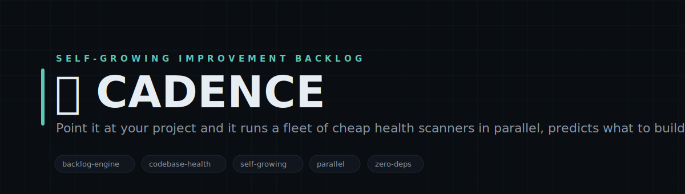
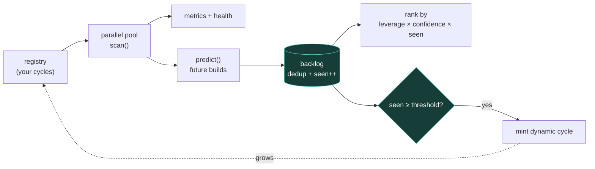

<!-- CADENCE — white-label. No personal or company identifiers in this file by design. -->

<p align="center">
  
</p>

<h1 align="center">🔁 CADENCE</h1>

<p align="center">
  <b>Point it at your project and it runs a fleet of cheap health scanners in parallel, predicts what to build next, and grows its own checklist over time.</b><br>
  <sub>CADENCE is a continuous self-improvement engine for a codebase. Each round it runs a fleet of tiny, $0, local scanners in parallel — test coverage, doc freshness, dependency drift, TODO/FIXME debt, untested files — each of which reads real on-disk state and PREDICTS the highest-leverage builds to do next. Predictions merge into a ranked, deduplicated backlog; anything that keeps recurring is PROMOTED into a new standing scanner, so the checklist grows itself. Scanners are just objects with scan() and predict(); bring your own, and plug in any LLM to enrich predictions. Runs once, N rounds, or forever.</sub>
</p>

<p align="center">

= 18">

</p>

<p align="center">
<code>backlog-engine</code> · <code>codebase-health</code> · <code>self-growing</code> · <code>parallel</code> · <code>zero-deps</code> · <code>cron-friendly</code>
</p>

---

## Why CADENCE

Most 'improve the codebase' work is reactive and forgettable. CADENCE makes it a standing loop. A cycle is one self-contained improvement scanner bound to a real signal — it reads true state (are there tests? is the README stale? are deps behind?) and proposes concrete future builds ranked by leverage. A super-loop runs the whole fleet in a bounded parallel pool, merges every prediction into a backlog keyed by build, and bumps a seen-count on repeats. When a prediction recurs past a threshold, it's minted into a new dynamic cycle — the registry literally grows itself toward the work that keeps mattering. It's cheap and offline by default (file reads only); wire in an LLM enricher and it proposes builds you didn't think of. Point it at any repo and let it compound.

---

## What it does

| Module | What it does | Signal |
|---|---|---|
| **cycle registry** | Each cycle = { scan(ctx)→{metrics,health}, predict(ctx,scan)→builds } bound to a real signal | cheap, local, $0 |
| **super-loop** | Runs the fleet in a bounded parallel pool, merges predictions into a ranked backlog | parallel + deduped |
| **self-growth** | A prediction seen N+ times is promoted into a new standing cycle — the registry grows itself | compounding |

---

## Architecture



---

## Quickstart

```bash
# 1. no install needed — pure Node builtins
node lib/cadence.cjs --dir=.                 # one round against the current project ($0, local)

# 2. compound over several rounds (backlog + registry may grow)
node lib/cadence.cjs --dir=. --rounds=3

# 3. see the ranked backlog it built
node examples/demo.cjs

# 4. run forever on an interval (great as a cron / service)
node lib/cadence.cjs --dir=. --loop --interval=900
```

> State (backlog + minted dynamic cycles) persists to ./data as JSONL/JSON, gitignored and auto-created. Scans are local file reads — $0 and offline. Pass your own cycles to runRound(), or an `enrich` function to have any LLM propose extra builds. Every stage is fail-open: a broken cycle degrades, the round never crashes.

---

## Repository layout

```
cadence/
├── lib/
│   ├── cadence.cjs         ← the super-loop: parallel scan → predict → backlog → promote
│   └── cycles.cjs          ← generic example cycles (tests / docs / deps / TODO-debt / untested files)
├── examples/
│   └── demo.cjs            ← run a round against this repo, print the ranked backlog
└── data/                   ← backlog.jsonl + dynamic-registry.json (gitignored, auto-created)
```

---

## Design principles

1. **Cheap and local by default.** Scans are file reads — $0, offline, safe to run on every commit or on a timer. Heavy/LLM work is opt-in.
2. **Build ahead of need.** Cycles don't just report health; they predict the concrete builds that raise it, ranked by leverage.
3. **The checklist grows itself.** Recurring predictions are promoted into new standing cycles — the registry compounds toward what matters.
4. **Fail-open + model-agnostic.** A broken cycle degrades, never crashes the round; the optional LLM enricher is a one-function hook.

---

<p align="center"><sub>CADENCE · scan · predict · promote · MIT</sub></p>
