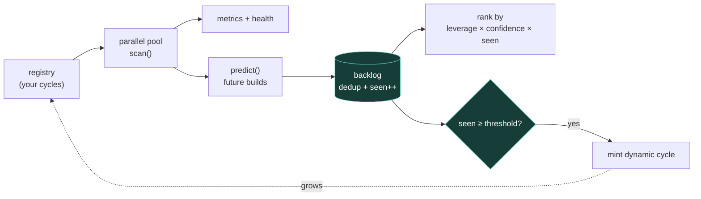

# Megacycle — Architecture

Megacycle is a continuous self-improvement engine for a codebase. Each round it runs a fleet of tiny, $0, local scanners in parallel — test coverage, doc freshness, dependency drift, TODO/FIXME debt, untested files — each of which reads real on-disk state and PREDICTS the highest-leverage builds to do next. Predictions merge into a ranked, deduplicated backlog; anything that keeps recurring is PROMOTED into a new standing scanner, so the checklist grows itself. Scanners are just objects with scan() and predict(); bring your own, and plug in any LLM to enrich predictions. Runs once, N rounds, or forever.

## Flow

## How it fits together

Megacycle is a registry of cycles plus a super-loop. A cycle is `{ id, title, domain, leverage, scan(ctx)->{metrics,health,notes}, predict(ctx,scan)->[{build,why,leverage,confidence}] }`. `ctx` is a set of cheap, defensive filesystem probes bound to a target directory (exists / ageHours / sizeKB / lines / read / fresh) that never throw. One ROUND: (1) run every cycle's scan() concurrently in a bounded pool; (2) collect each cycle's predictions; (3) merge them into ./data/backlog.jsonl keyed by a slug of the build, deduping and bumping a seen-count on repeats; (4) PROMOTE — any prediction seen >= a threshold and not already a cycle is minted into ./data/dynamic-registry.json, so the fleet grows itself; (5) rank the backlog by leverage × confidence × seen and report. The super-loop repeats a round --once, --rounds=N, or --loop on an --interval. Everything is $0 and local by default (file reads only); an optional `enrich(domain, scan)` hook lets any LLM add predictions. `lib/cycles.cjs` ships generic cycles — test coverage, doc freshness, dependency drift, TODO/FIXME debt, untested source files — each reading real repo state. Every stage is guarded and fail-open, so one broken cycle degrades rather than crashing the round.

## Extending it

Every capability is a self-contained module. To add your own, follow the contract the existing
modules use and wire it into the entry point. Keep it portable — config via `.env`, no hardcoded
paths, no personal accounts.

## Design principles

1. **Cheap and local by default.** Scans are file reads — $0, offline, safe to run on every commit or on a timer. Heavy/LLM work is opt-in.
2. **Build ahead of need.** Cycles don't just report health; they predict the concrete builds that raise it, ranked by leverage.
3. **The checklist grows itself.** Recurring predictions are promoted into new standing cycles — the registry compounds toward what matters.
4. **Fail-open + model-agnostic.** A broken cycle degrades, never crashes the round; the optional LLM enricher is a one-function hook.
